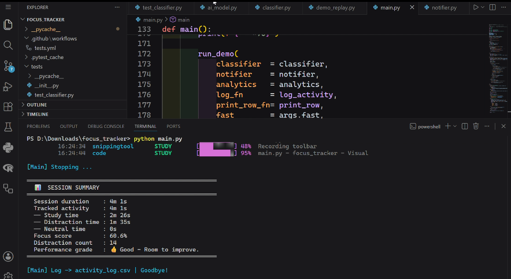
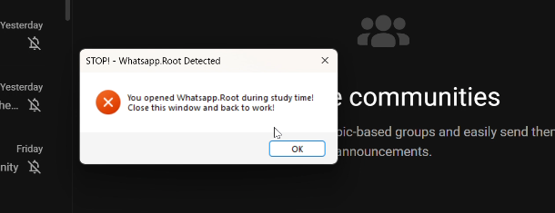
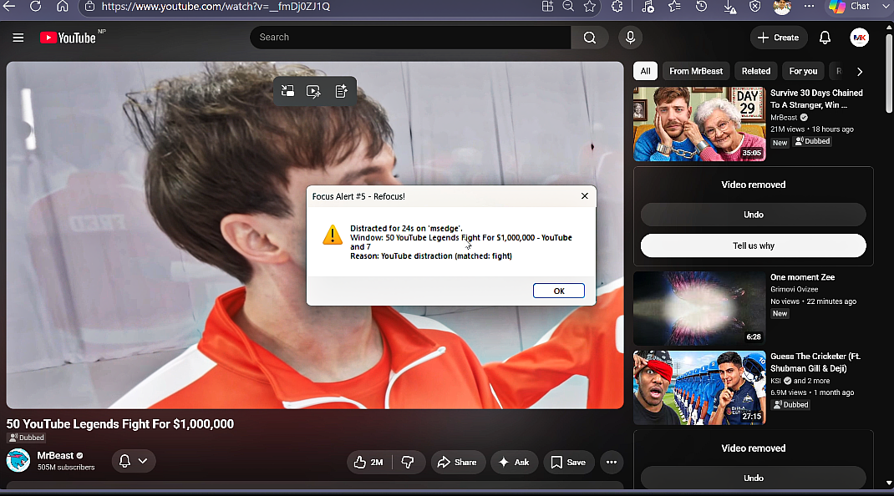

# AI-Powered Focus Tracker & Distraction Detection System


> A real-time desktop productivity tool for students that monitors computer activity, classifies it as **Study** or **Distraction** using a hybrid AI engine (Rule-based + TF-IDF + Logistic Regression), and fires instant alerts when focus is lost.

**Cross-platform** - works on Windows, macOS, and Linux. Includes a `--demo` flag for live presentations without needing a real desktop session.

---


---

## What You'll See in Action

The system fires **two types of alerts** depending on the distraction:

- **Immediate alert** - triggered the moment you open WhatsApp, Instagram, or any social media
- **Threshold alert** - triggered after 15 seconds of continuous distraction on YouTube or Netflix

| Dashboard             | WhatsApp Alert             |
| --------------------- | -------------------------- |
|  |  |

| YouTube Alert             | Session Summary             |
| ------------------------- | --------------------------- |
|  |  |

## What's New (v3.0)

| Feature        | Before                 | Now                                                             |
| -------------- | ---------------------- | --------------------------------------------------------------- |
| **OS Support** | Windows only (pywin32) | Windows + macOS + Linux (psutil + ctypes/AppleScript/xdotool)   |
| **Demo Mode**  | None                   | `python main.py --demo` replays 20 pre-recorded windows         |
| **Tests**      | None                   | 27 pytest tests (domains, social media, study apps, edge cases) |
| **CI/CD**      | None                   | GitHub Actions - runs tests on every push                       |

---

## 📁 Project Structure

```
FOCUS_TRACKER/
├── main.py              <- Entry point - run this to start the system
├── tracker.py           <- Cross-platform active window detector (Win/Mac/Linux)
├── classifier.py        <- Rule-based + ML hybrid classification engine
├── ai_model.py          <- TF-IDF + Logistic Regression model (train & predict)
├── notifier.py          <- Cross-platform desktop popup + sound alert system
├── demo_replay.py       <- Pre-recorded activity CSV replay engine (--demo)
├── utils.py             <- CSV logging, session analytics, focus score
├── dataset.csv          <- Labeled training data (STUDY / DISTRACTION / NEUTRAL)
├── model.pkl            <- Pre-trained ML model (auto-loaded at runtime)
├── activity_log.csv     <- Auto-generated session log with timestamps
├── requirements.txt     <- Python dependencies
├── tests/
│   ├── __init__.py
│   └── test_classifier.py  <- 27 pytest tests
└── .github/
    └── workflows/
        └── tests.yml    <- GitHub Actions CI pipeline
```

---

## Prerequisites

| OS                | Requirements                             |
| ----------------- | ---------------------------------------- |
| **Windows 10/11** | Python 3.10+, no extra system tools      |
| **macOS 12+**     | Python 3.10+, no extra system tools      |
| **Linux (X11)**   | Python 3.10+, `sudo apt install xdotool` |

---

## Step 1 - Clone & Install Dependencies

```bash
git clone https://github.com/manishkrmahato/focus-tracker.git
cd focus-tracker
pip install -r requirements.txt
```

**Linux extra step:**

```bash
sudo apt install xdotool          # window detection
sudo apt install pulseaudio-utils # sound alerts (optional)
```

---

## Step 2 - Train the AI Model

> `model.pkl` is already included. Skip this unless you modify `dataset.csv`.

```bash
python ai_model.py
```

Expected output:

```
[AI Model] Training on dataset.csv ...
[AI Model] 107 samples | classes: ['DISTRACTION', 'NEUTRAL', 'STUDY']
[AI Model] Accuracy: 86.4%
[AI Model] Saved -> model.pkl
```

---

## Step 3 - Run the Tracker

### Live Mode (tracks your real windows)

```bash
python main.py
```

### Demo Mode (pre-recorded replay - works on any OS, no display needed)

```bash
python main.py --demo          # real-time pacing
python main.py --demo --fast   # instant replay (used in CI)
```

### Live terminal output

```
══════════════════════════════════════════════════════════════════════
  AI Focus Tracker v3.0 - Rule-Based + ML Hybrid  [Live Tracking]
══════════════════════════════════════════════════════════════════════

  IDX    TIME        APP              CAT            CONFIDENCE         TITLE
  ──────────────────────────────────────────────────────────────────────
  [ 1/20] 20:16:57  code            STUDY          [█████████░] 95%  main.py - focus_tracker
  [ 5/20] 20:17:01  chrome          DISTRACTION    [█████████░] 95%  YouTube - Funny Cat Compilation
                    ↳ YouTube distraction (matched: funny, compilation)
  [10/20] 20:18:44  whatsapp        DISTRACTION    [██████████] 100% WhatsApp
                    ↳ Social media - always distraction
```

**To stop:** Press `Ctrl+C`

---

## Step 4 - Run Tests

```bash
pytest tests/ -v
```

Expected output:

```
tests/test_classifier.py::TestDomains::test_youtube_entertainment_is_distraction PASSED
tests/test_classifier.py::TestDomains::test_leetcode_is_study PASSED
tests/test_classifier.py::TestDomains::test_spotify_is_distraction PASSED
tests/test_classifier.py::TestDomains::test_netflix_is_distraction PASSED
tests/test_classifier.py::TestDomains::test_stackoverflow_is_study PASSED
...
27 passed in 0.06s
```

---

## Alert System

| Activity Type                                                      | Behaviour                                                    |
| ------------------------------------------------------------------ | ------------------------------------------------------------ |
| **WhatsApp, Instagram, Telegram, Discord, Snapchat**               | **Immediate** popup + sound - fires every time app is opened |
| **YouTube entertainment** (funny, meme, trailer, song)             | Alert after **15 seconds** continuous distraction            |
| **Browser on distraction site** (Netflix, Reddit, Spotify, Amazon) | Alert after **15 seconds**                                   |
| **YouTube education** (tutorial, lecture, OS, algorithm)           | No alert - classified as STUDY                               |
| **VS Code, Jupyter, GitHub, StackOverflow, LeetCode**              | No alert - classified as STUDY                               |

> Timer is keyed by **app**, not tab title - switching YouTube videos does not reset the clock.

---

## How Classification Works

```
Active Window (app + title + URL)
        ↓
Rule 1: Social media app?         -> DISTRACTION (100% confidence, immediate alert)
        ↓ No
Rule 2: YouTube? -> read title     -> STUDY or DISTRACTION (keyword scoring)
        ↓ confidence < 72%
Rule 3: Browser? -> check domain   -> STUDY or DISTRACTION (domain allowlist/blocklist)
        ↓ confidence < 72%
Rule 4: Known coding app?         -> STUDY (95%)
        ↓ No
Rule 5: Keyword score on title    -> STUDY or DISTRACTION
        ↓ confidence < 72%
Rule 6: ML Model (TF-IDF + LR)   -> STUDY / DISTRACTION / NEUTRAL (fallback)
```

---

## Session Summary (printed on Ctrl+C)

```
═══════════════════════════════════════════════════
  📊  SESSION SUMMARY
═══════════════════════════════════════════════════
  Session duration    : 24m 10s
  Study time          : 18m 40s
  Distraction time    : 4m 22s
  Neutral time        : 1m 8s
  Focus score         : 81.0%
  Distraction count   : 3
  Performance grade   : Good - Room to improve.
═══════════════════════════════════════════════════
```

All activity is also saved to `activity_log.csv`:
`timestamp, app, title, category, duration_sec`

---

## GitHub Actions CI

On every push to `main`, the CI pipeline:

1. Installs all dependencies on Ubuntu
2. Trains the ML model
3. Runs all 27 pytest tests
4. Runs `python main.py --demo --fast` as an end-to-end smoke test

## To enable: push to GitHub -> Actions tab -> see the badge turn green.

## Configuration (`main.py`)

| Parameter                   | Default | Description                                    |
| --------------------------- | ------- | ---------------------------------------------- |
| `POLL_INTERVAL_SEC`         | `2`     | How often the active window is checked         |
| `DISTRACTION_THRESHOLD_SEC` | `15`    | Seconds before a non-social alert fires        |
| `ALERT_COOLDOWN_SEC`        | `45`    | Minimum gap between repeat alerts for same app |
| `CONFIDENCE_THRESHOLD`      | `0.65`  | Minimum confidence to trigger alert            |

---

## Tech Stack

| Component            | Technology                                                 |
| -------------------- | ---------------------------------------------------------- |
| **Window Detection** | `ctypes` (Windows), `osascript` (macOS), `xdotool` (Linux) |
| **Process Info**     | `psutil` - cross-platform                                  |
| **ML Model**         | `scikit-learn` - TF-IDF + Logistic Regression              |
| **Rule Engine**      | Custom Python classifier (6-rule cascade)                  |
| **Desktop Popup**    | `ctypes` (Win), `osascript` (Mac), `notify-send` (Linux)   |
| **Sound Alert**      | `winsound` (Win), `afplay` (Mac), `paplay` (Linux)         |
| **Testing**          | `pytest` + `pytest-cov`                                    |
| **CI/CD**            | GitHub Actions                                             |
| **Data Logging**     | `csv` (standard library)                                   |

---

## Deploying / Sharing (for Resume)

The demo mode makes this project **zero-setup shareable**:

- **Recruiter demo:** `python main.py --demo` - they see it working immediately
- **GitHub:** Push everything; CI badge shows green on your repo page
- **Screencast:** Run `python main.py --demo` and record terminal with OBS
- **Live use:** Run `python main.py` while coding - produces a real `activity_log.csv`

---

_Developed by Manish Kumar Mahato - 24CSB1A34_
